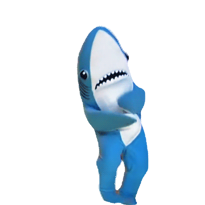

<h1 align="center">
    🍪 <i><b>AS Backend разработка</b></i> 🍪
</h1>

> **_Андрей Подовинов, ОмГТУ, ФИТ-212_**

  

---

> **_Список дел_ на интенсиве**

  

-   **Спринт 1**

    ✅ [-->](https://github.com/ledi-bruh/AS-Backend/tree/main/tasks/task1.1) Ближайший ноль

    ✅ [-->](https://github.com/ledi-bruh/AS-Backend/tree/main/tasks/task1.2) Ловкость рук

-   **Спринт 2**

    🔳 None

-   **Спринт 3**

    🔳 None

-   **Спринт 4**

    🔳 None

-   **Спринт 5**

    🔳 None

-   **Спринт 6**

    🔳 None

-   **Спринт 7**

    🔳 None

-   **Спринт 8**

    🔳 None
